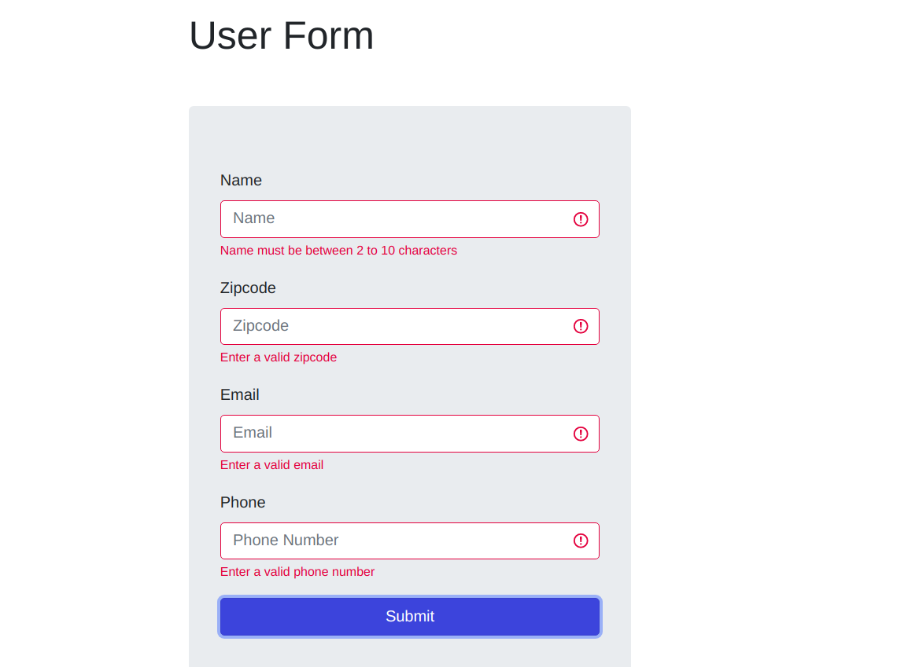
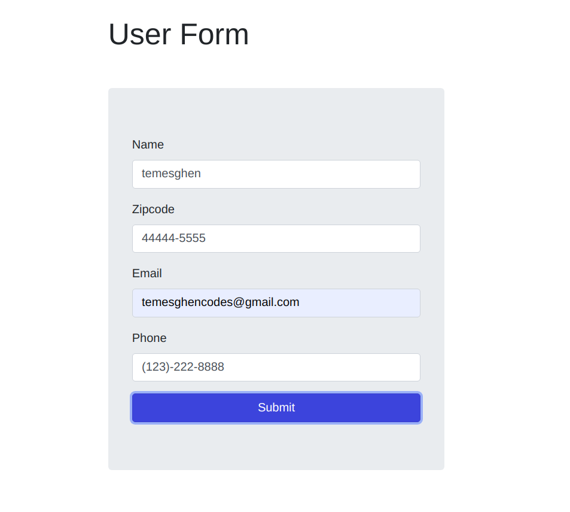

# Form Validation JS

## Content

<a text-align="center" href="#about">About</a>&nbsp;&nbsp;&nbsp;|&nbsp;&nbsp;&nbsp;
<a href="#live">Live Demo</a>&nbsp;&nbsp;&nbsp;|&nbsp;&nbsp;&nbsp;
<a href="#screenshots">Screenshots</a>&nbsp;&nbsp;&nbsp;|&nbsp;&nbsp;&nbsp;
<a href="#with">Built with</a>&nbsp;&nbsp;&nbsp;|&nbsp;&nbsp;&nbsp;
<a href="#setup">Setup</a>&nbsp;&nbsp;&nbsp;|&nbsp;&nbsp;&nbsp;
<a href="#prerequisites">Prerequisites</a>&nbsp;&nbsp;&nbsp;|&nbsp;&nbsp;&nbsp;
<a href="#author">Author</a>

## About 

This project is intended to showcase form validatin skills in JavaScript using Regular Expressions. 
In nutshell, the project allows a user to:
<li>validate a name</li>
<li>validate a zipcode</li>
<li>validate an email address</li>
<li>validate a phone number</li>

## 🔴 Live Demo 

**Click [here](https://formvalidation-js-temesghen.netlify.app/) in order to see a Live Demo of this project.**

## Screenshots 

### Form with failed validation
 
### Form with successful validation
 

## 🔧 Built with

- HTML
- Bootstrap
- Vanilla JavaScript
- ES6
- ESLint

## 🔨 Setup
### Run a Local Copy
- Download the repository to a local directory on your computer.
- Or run the following commands on the terminal
  - git clone https://github.com/temesghentekeste/form-validation-js.git
  - cd form-validation-js
  - open index.html file

## Prerequisites
- A modern up-to-date browser

## ✒️  Author 

👤 **Temesghen Tekeste**

- Github: [@temesghentekeste](https://github.com/temesghentekeste)
- Twitter: [@temesghentekes1](https://twitter.com/temesghentekes1)
- Linkedin: [temsghen tekeste](https://www.linkedin.com/in/temesghentekeste/)

## 🤝 Contributing

Contributions, issues and feature requests are welcome!

Feel free to check the [issues page](https://github.com/temesghentekeste/form-validation-js/issues).

## 👍 Show your support

Give a ⭐️ if you like this project!

## :clap: Acknowledgements
- <a href="https://www.udemy.com/course/modern-javascript-from-the-beginning/" target="_blank">Modern JavaScript From The Beginning</a>
- <a href="https://www.microverse.org/" target="_blank">microverse.org</a>

